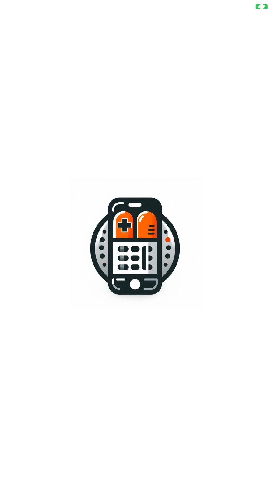
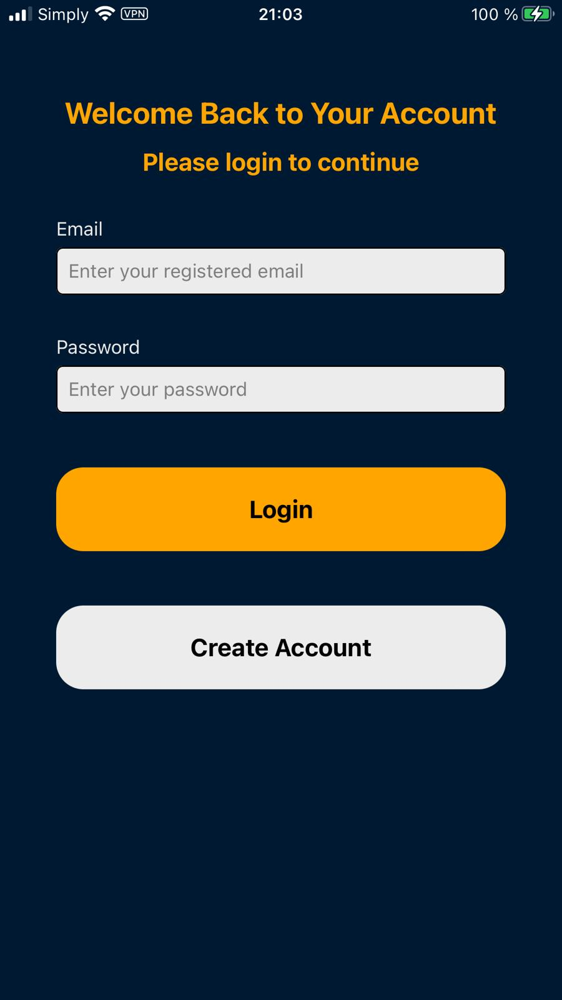
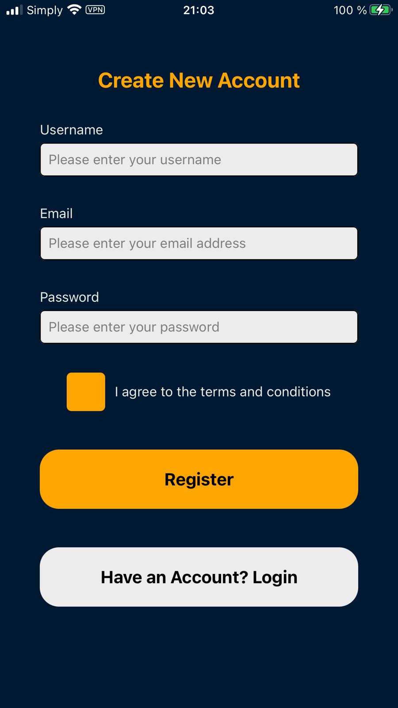
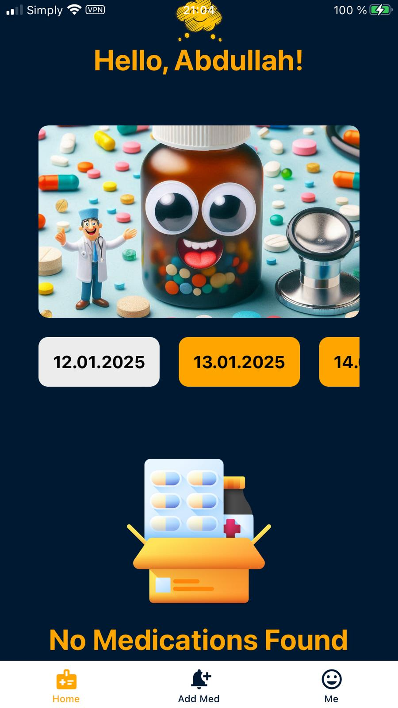
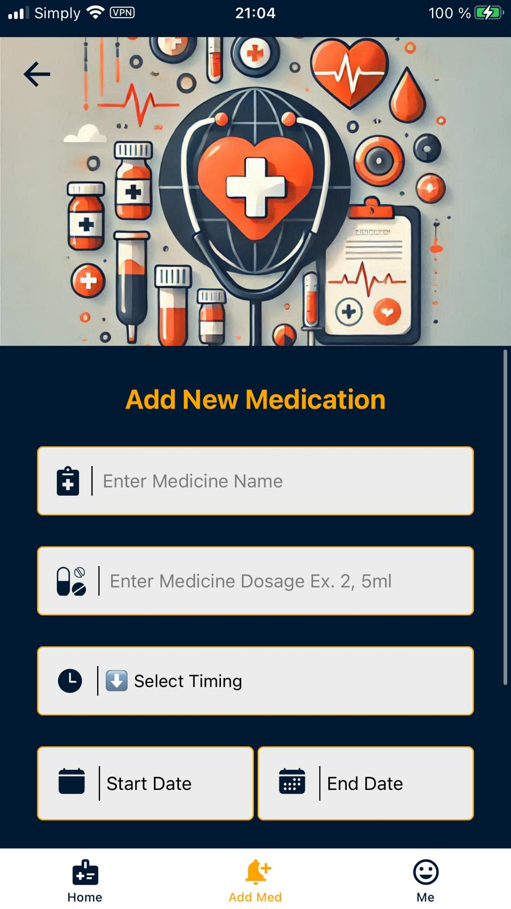
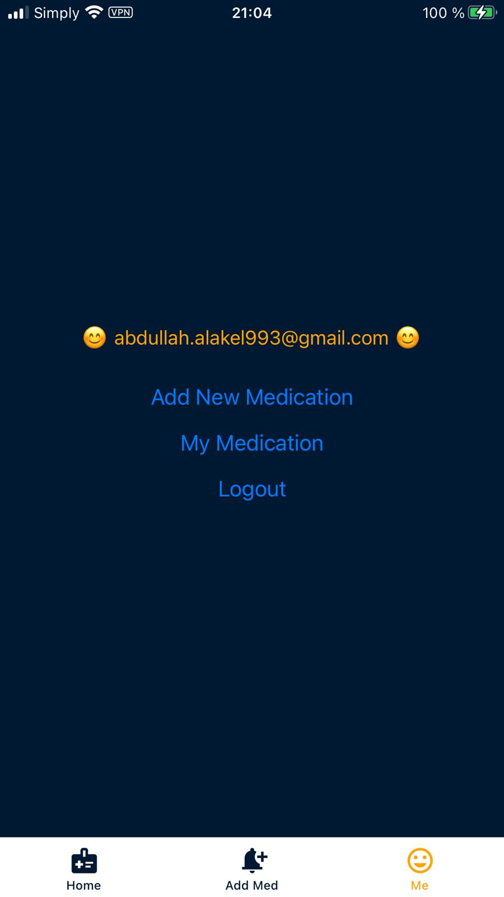

<h1 align="center">👋Welcome To Your Hi Med Assist Mobile App👋</h1>
<h2> 
Hi-Med-Assist-App is an intuitive medication management app built with React Native and Expo. It offers seamless functionality, including medication details storage and precise reminders, all powered by Firebase, a flexible NoSQL database. Enjoy the ease of Expo's tools while maintaining the power of React Native. Stay organized and never miss a dose with Hi-Med-Assist-App, your reliable health companion.
</h2>

